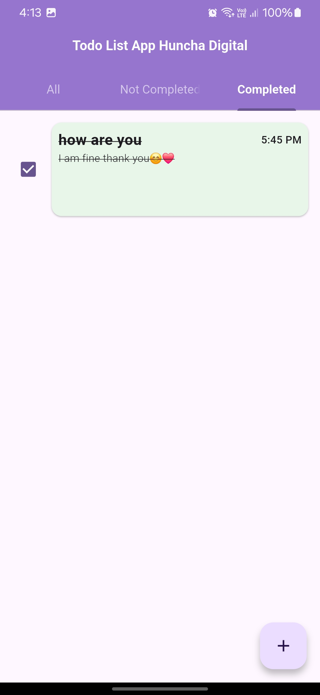

# Todo App Project

This is a **Todo App** built using **Flutter** for the frontend, **Firebase** as the backend, and adhering to the **SOLID principles** of software design. The app allows users to manage their tasks efficiently, with features like adding, updating, deleting, marking tasks as complete, and receiving **push notifications** for task reminders. Firebase provides real-time data synchronization, authentication, and cloud messaging for notifications, ensuring a seamless user experience.

## Table of Contents

- [Features](#features)
- [Technologies Used](#technologies-used)
- [Screenshots](#screenshots)

---

## Features

- **Add Tasks**: Users can add new tasks with a title, description, and due date.
- **Update Tasks**: Modify existing tasks easily.
- **Delete Tasks**: Remove tasks that are no longer needed.
- **Mark as Complete**: Mark tasks as completed to track progress.
- **Real-Time Sync**: Firebase ensures real-time updates across devices.
<!-- - **Authentication**: Secure user login and registration using Firebase Auth. -->
- **Push Notifications**: Receive reminders for upcoming or overdue tasks via Firebase Cloud Messaging (FCM).

---

## Technologies Used

- **Frontend**: Flutter (Dart programming language)
- **Backend**: Firebase (Firestore for database, Authentication for user management, Cloud Messaging for notifications)
- **Design Principles**: SOLID principles for clean and maintainable code
- **State Management**: Provider for State Management
- **Notifications**: Firebase Cloud Messaging (FCM) for push notifications

---

## Screenshots

Below are some screenshots of the Todo app in action:

| Title               | Image                                                                 | Description                                     |
|---------------------|-----------------------------------------------------------------------|-------------------------------------------------|
| Login Screen        |                        | User authentication screen                      |
| Todos List          |                      | View all tasks in a clean and organized list    |
| Add Task            |                            | Add a new task with a title and description     |
| Completed Tasks     |                  | View tasks marked as completed                  |

---